# オシロスコープの使い方
このファイルは筑波大学理工学群、応用理工学類応用物理主専攻3年次の専攻実験(テーマ：オプトエレクトロニクス)用に作成しています。  
作成者は2025年度TAの山本隼大(関口・早田研、前期博士課程1年)です。  

使用するオシロスコープはKEYSIGHTの[**EDUX1052G**](https://www.keysight.com/jp/ja/product/EDUX1052G/oscilloscope-50-mhz-2-analog-channels-waveform-generator.html)です。  
マニュアルは[ここ](https://www.keysight.com/jp/ja/assets/9921-02770/user-manuals/9018-70020.pdf)からダウンロードできます。  
このオシロスコープは基本的な機能である波形の観察に加えて、ファンクションジェネレータ機能（波形を発生させる機能）や、周波数特性の測定を一台で完結することができる優れものです。  

他社製のオシロスコープでも同様の使い方で測定を行うことができるので、是非来年以降の研究でも参考にしていただければと思います。  

## プローブについて
プローブはオシロスコープと被測定物の電気的接続を取るためのものです。一般的には細長い棒状のものを使いますが、被測定物や測定する周波数帯によってはBNCケーブルなどを直接繋ぐこともあります。  

### プローブ倍率
プローブには倍率を切り替えるスイッチが付いています。一般的には1:1と10:1の2つが切り替え可能になっていることが多いですが、**本実験では10:1を基本として測定を行いましょう**。その理由としては、プローブの入力インピーダンスをできるだけ大きくして回路や信号への影響を最小限に留めるためです。  
オシロスコープの入力インピーダンスは1MΩ程度のものが多いですが、プローブを10:1にすることで、入力インピーダンスを10倍の10MΩにすることができます。その分、信号の電圧が1/10になってしまうので、オシロスコープ内部で10倍に増幅して表示することになります。  

#### オシロスコープ側の設定
まず、プローブの倍率を変更したいチャンネルを選択します。ここでは例として**Ch1**を選択します。  

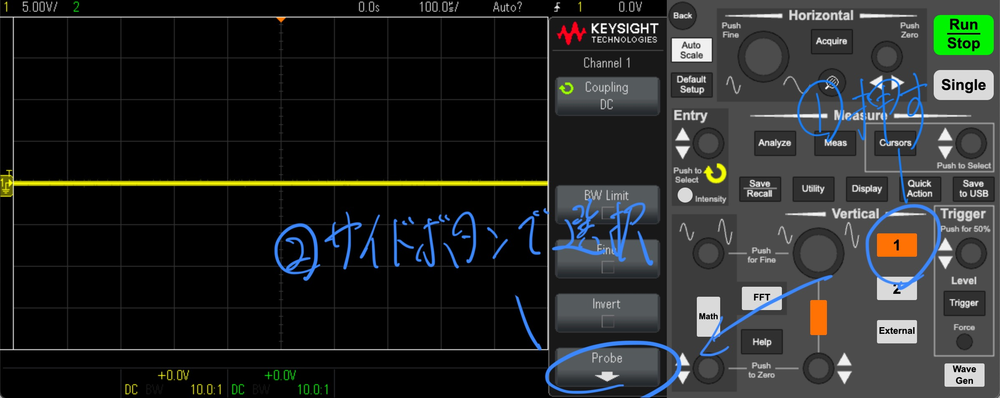  
**プローブの倍率の確認方法その1**  

次に画面右側のプローブを選択し、倍率をプローブと同様の値に変更します。  
この操作を怠ると、誤った電圧やゲインが表示されてしまうため、セットアップの一環として必ず確認するようにしましょう。  

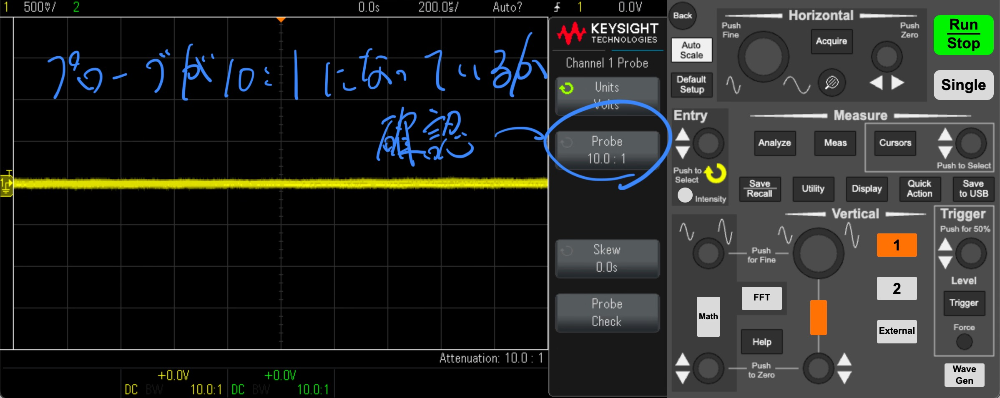  
**プローブの倍率の確認方法その2**  

### プローブの補正
オシロスコープのセットアップとして重要な設定に、プローブの補正があります。ケーブルやオシロスコープの入力部分には容量成分(コンデンサ成分)が存在するため、これを打ち消さないとプローブ自身がLRCフィルタとなってしまい、正しい測定ができません。  
そこで、直列にコンデンサ成分を追加して、容量成分を打ち消す必要があります。  
[参考資料](https://cc.cqpub.co.jp/system/contents/1246/)  

#### 補正方法
まず、補正したいプローブをオシロスコープ下部にある端子と図のように接続します。  

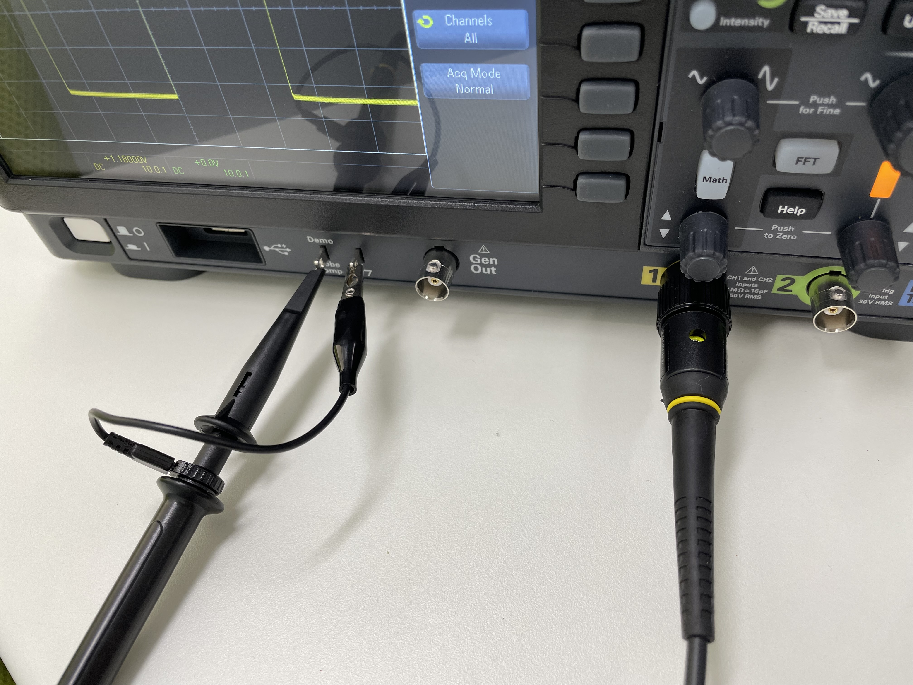  
**プローブの接続方法**  

次に接続されているチャンネル選択ボタンを押して、ボタンが点灯していることを確認します。さらに、右上の`Auto Scale`ボタンを押すと、矩形波（方形波）が表示されるはずです。これで補正の準備完了です。  

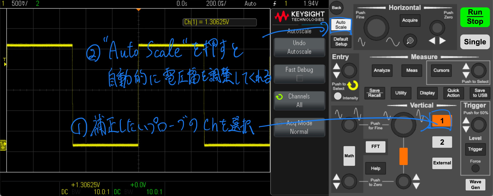  
**プローブ補正の手順**  

プローブには補正用のトリマーが付いています(図参照)。これを調整することで、直列のコンデンサ容量を調整します。エッジが適切な角度になり、理想的な矩形波が得られるように調整してください。十分に調整できたら問題ありません。  

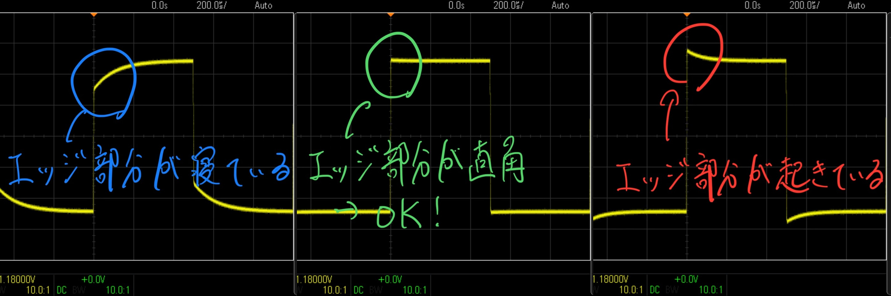  
**最適な形状に調整する**  

## 波形の観察方法
オシロスコープの最も基本的な機能である波形観察の方法について解説します。  

まず、大前提として横軸(x軸)方向が時間軸、縦軸(y軸)方向が電圧軸になります。サイン波を印加すれば $y=\sin{x}$ のグラフが描画されるイメージです。上部に時間や電圧のスケールが書いてありますが、これは1目盛りあたりの値を示しています。  

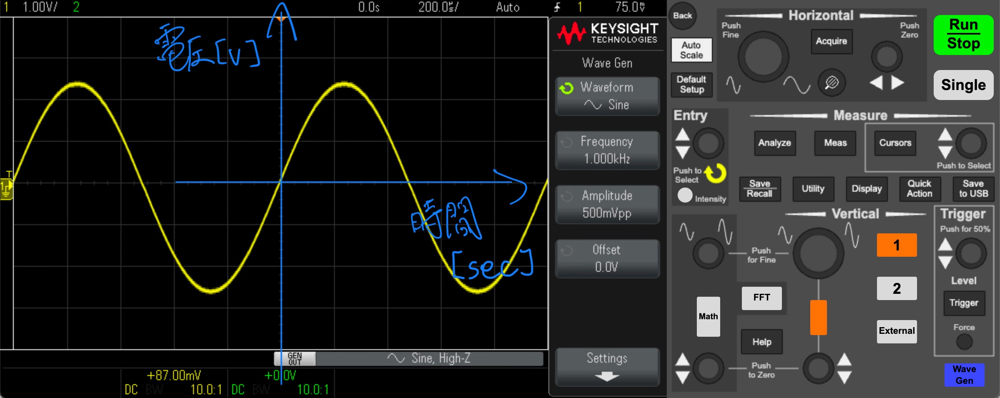  
**時間軸と電圧軸で表される**  

### 軸の調整方法
ここからは実際に波形を見やすいい形に調整していきます。例として、プローブの補正に使う矩形波を使います。まず、補正時と同様に`Auto Scale`ボタンを押しましょう。そうすると、ある程度整った波形が描画されるはずです。  

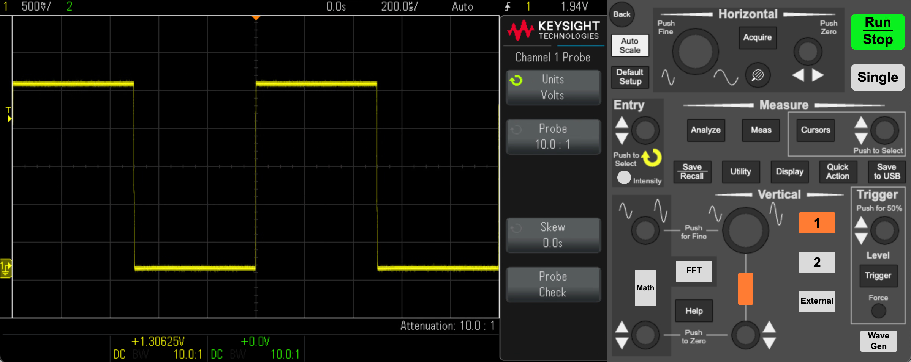  
**表示される波形の一例**  

次に、エッジ部分をもっと詳細に見たいとします。電圧軸を拡大・縮小するときは操作部中央の大きなツマミ(`Vertical`と書かれたツマミ)を調整します。ツマミを押し込むと、粗調整モードと微調整モードが切り替わります。  

電圧オフセット(中心の高さ)を切り替えたいときは下にある▲▼が書かれたツマミを調整します。押し込むことでオフセットがゼロに戻ります。  

時間軸方向の調整は`Horizontal`と書いてあるセクションで行います。左の大きいツマミが拡大縮小、右の小さいツマミが時間オフセットです。  
それぞれ押し込むことで、電圧軸方向のそれと同様の切り替えやオフセットのリセットが行えます。  

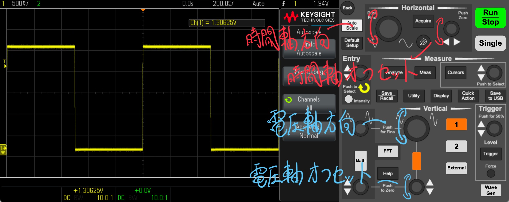  
**電圧軸、時間軸の調整**  

### トリガーの設定
オシロスコープをマスターするうえで、最も重要な設定が**トリガー**です。トリガーとは時間で変動する電圧を安定的に表示するための機能です。トリガーを適切に設定しないと大きく荒ぶった波形となり、これでは到底測定には役立ちません。測定したい波形を確実に捉えるために必須となる機能であり、多くのモードがありますが、今回は低周波を扱ううえで最も基本的な設定に絞って紹介します。  

まず、トリガーモードはいくつかありますが、とりあえず最も一般的なトリガーである**エッジトリガー**を用いることにします。エッジトリガーにも立ち上がりを検出するものと立ち下がりを検出するものがありますが、一般的には立ち上がりを検出するものを選択するとよいでしょう。操作パネル右端の`Trigger`ボタンを押すとトリガーの設定画面が表示されるので、`Trigger Type`に**Edge**、`Slope`に上向きのダイオードのような図を選択します。  

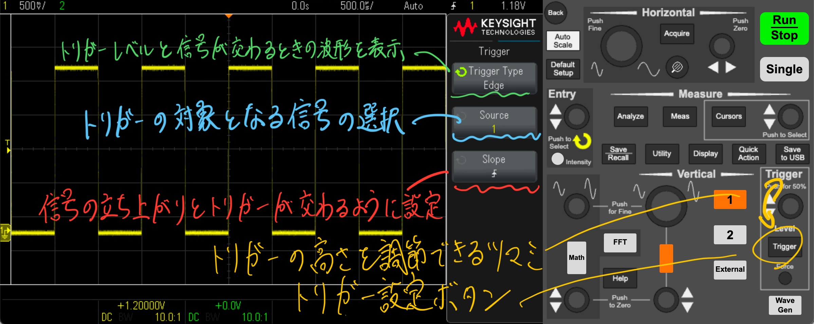  
**トリガーの調整**  

次に、トリガーのソースを設定します。これはトリガーをかける波形を選択するもので、今回は**Ch1**を選択します。内蔵のファンクションジェネレータを測定に使っている場合はWave Genをソースに選択してもよいでしょう。  

最後に、トリガーレベルを調整します。右端の`Trigger`と書かれたツマミを調整することで、オレンジのバーが上下することが確認できます。このオレンジバーの横線をトリガーレベルといい、この電圧を超える波形のみを取り出し、表示することができます。  
正しくトリガーを設定すると、波形が安定して表示されます。  

### 各数値を調べる
表示している波形の電圧や周波数を確認したいタイミングは往々にしてありますが、毎度目盛りを読むのは面倒なものです。そのため、デジタルオシロスコープには周波数や周期、電圧の振幅のピーク値や実効値を表示してくれる機能があります。  
`Meas`ボタンを押すことでサイドバーにMeasurementモードが開きます。そこから`Source`を選択し、`Type`を選択します。セレクトノブを押し込むか、`Add Measurement`を押すことで、下部に固定表示することができます。測定データは最大5個まで追加できます。  

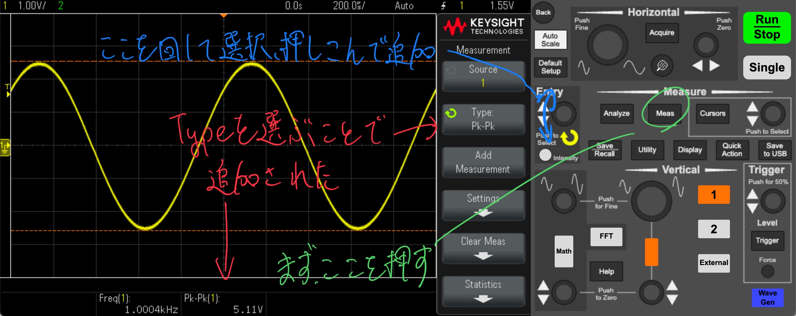  
**波形の特性の測定方法**  

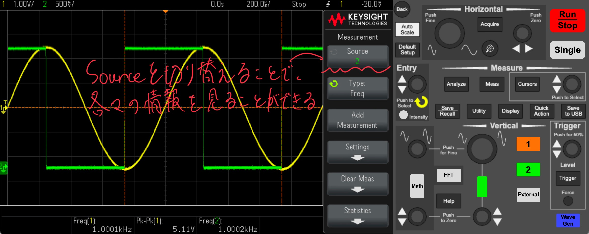  
**複数のSourceの特性を同時に見ることができる**  

### 波形表示を一時停止する
波形表示を一時停止するには右上の`RUN/STOP`ボタンを押します。すると波形が止まり、ボタンが赤くなると思います。  
再開するにはもう一度`RUN/STOP`ボタンを押せばOKです。  

## 周波数特性分析(FRA)
**FRA**(Frequency Response Analyzer)は装置の周波数応答を調べる装置を指し、この機能が本実験で用いるオシロスコープでは実装されています。アンプ等の周波数特性を分析することで、増幅可能な周波数レンジを定量的に評価することが可能です。理想的な特性としては低周波まで高周波まで真っ直ぐ伸びていることが望ましいです。例えば、あるヘッドホンアンプの周波数特性が人間の可聴域より狭いと、音が籠もって聞こえたり、キンキンして聞こえることがあります。また、低周波だけ強い特性を持つ場合は、ベースやバスドラムなどの低音が強調されて聞こえます。  

### 基本的なセットアップ
まず、`Analyze`→`Features`を開き、FRAを選択します。そうすると、左側にグラフが表示されます。  

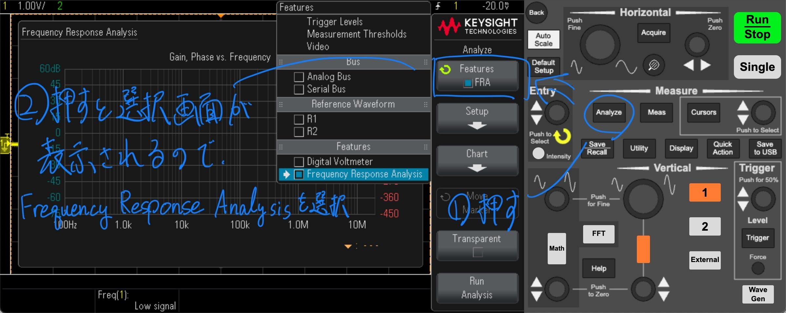  
**FRAのセットアップ方法①**  

次に、被測定物にプローブを取り付けていきます。Setupを開くと、ディレクションが表示されるので、このように接続していきます。具体的にはGenOutと**Ch1**を入力、Ch2を出力に取り付けます。  

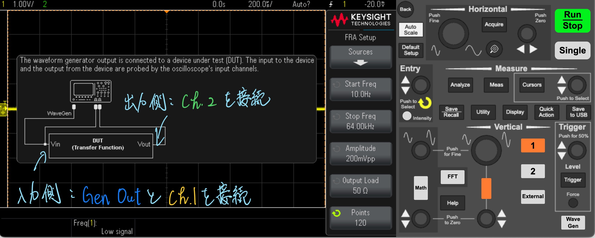  
**FRAセットアップ方法②(Setupを押すと表示される画面)**  

FRA Setupの画面に戻り、測定のためのパラメータを調整していきます。`Start Freq`と`Stop Freq`に測定したい周波数の上限/下限を入力します。例として、可聴帯域を測定したいとするならば**10Hz~20kHz程度**が望ましいでしょう。  
`Amplitude`は入力するサイン波の大きさを調整します。クリップ（音割れ）しない範囲で調整しつつ、小さすぎるとノイズの影響が支配的になってしまい、正確な測定ができません。あらかじめどれくらいの大きさの信号ならクリップしないか確認しておきましょう。  
`Output Load`はとりあえず**50Ω**で構いません。`Points`は測定点数を示し、点数が多いほど精密な測定が期待出来ますが、その分測定時間が長くなります。可聴域程度であれば**200~300程度**でも十分だと思います。  

### 結果の見方
`ゲイン(Gain)`が青線、`位相(Phase)`が赤線で表示されています。x軸は周波数で、ゲインの単位はdBで、 $A\,\mathrm{[dB]}=20\log_{10}\frac{V_{OUT}}{V_{IN}}$ で表される無次元量です。0dBで1倍、3dBで約√2倍、6dBで約2倍、20dBで10倍、40dBで100倍と覚えてください。位相は基準信号からの位相のズレを表していますが、本実験ではあまり重要ではないので無視して構いません。回路の発振可能性を評価するときなどに用いられます。  

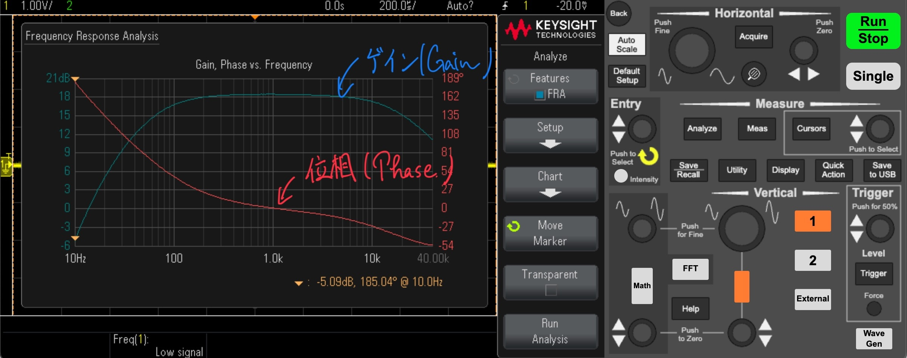  
**FRA結果の一例 [被測定物：家に転がっていたエレキギター用のエフェクター(自作)]**  

### 結果の保存方法
『*データの保存方法*』>『*FRA結果を保存する*』項を参照。  

## 高速フーリエ変換(FFT)
高速フーリエ変換とは離散フーリエ変換を計算機上で高速に計算するアルゴリズムです(Wikipedia)。測定した波形を周波数成分に分解することができます。  

### 基本的なセットアップ
FFTを呼び出す方法は簡単です。下側にある`FFT`ボタンを押すだけです。  

そうするとFFTの設定画面が表示されます。`Span`は表示する周波数帯の広さを、`Center`は画面中央に位置する周波数を設定することができます。  

ただし、歪み率の計算などの細かい分析はできません。詳細な分析が必要な場合は後述の『*Pythonを使ってFFTする*』項を参照してください。  

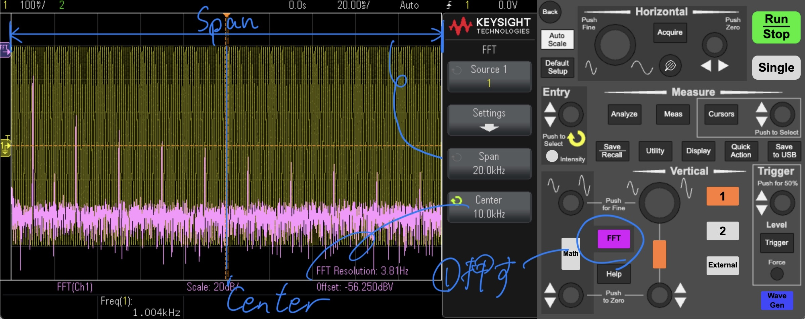  
**FFT結果の表示例**、このように時間範囲を広げるとFFTの周波数分解能が向上する  

### 高分解能化のテクニック
FFTの周波数分解能（どれくらい細かく周波数を分けて分析できるかという指標）は、基本的に解析時間 $T$ の逆数 $\frac{1}{T}$ に依存します。多くのオシロスコープでは、FFTに用いるデータが画面表示範囲と連動しているため、高い分解能を得るには、図のように時間幅を広く取ることが必要になります。  

しかし、**サンプル数**（FFTで解析するデータ点の数）はオシロスコープごとに固定されている場合が多く（たとえば、EDUX1052Gの場合は最大50,000点）であり、時間幅を広げすぎると1秒間あたりのサンプル数を示す**サンプリング周波数** $f_s\,[\mathrm{Hz}]$ が低下してしまいます。サンプリング周波数が下がると、FFTで表示可能な最大周波数である**ナイキスト周波数** $f_N\,[\mathrm{Hz}]$（ $f_N = \frac{f_s}{2}$ ）も下がってしまい、高周波数帯域が十分に解析できなくなる可能性があります。  
例えば上の図のように1グリッドあたり20msのとき、画面全体に表示されている時間幅は200msなので、サンプリング周波数 $f_s=\frac{50,000}{200\,\mathrm{[ms]}}=250\,\mathrm{kHz}$ となり、ナイキスト周波数 $f_N$ はこの半分の $125\,\mathrm{kHz}$ となります。  

まとめると、時間幅を大きくすると周波数分解能は上がりますが、過度に時間幅を広くしすぎるとサンプリング周波数が下がり、最大解析周波数が低くなってしまいます。逆に、時間幅を小さくしすぎると周波数分解能が粗くなるため、高すぎる周波数しか解析できなくなる可能性があります。オシロスコープでFFTを行う際は、**時間幅、サンプリング周波数**のバランスを考えながら、解析したい周波数帯域と分解能の両方を満たす設定を見つけることが大切です。  

参考までに、もし時間窓が短い場合、分解能が低下し下画像の様にピークの裾引きが長くなります。  

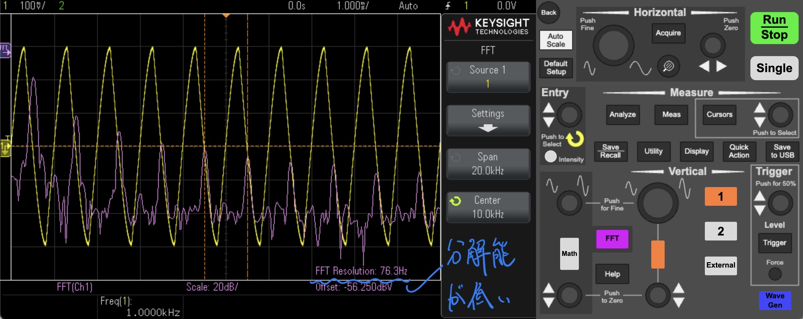  
**波形の表示範囲が狭いと周波数分解能が低下する**  

### Pythonを使ってFFTする
波形のFFT結果を知るために最も簡単で合理的な方法はPythonを使う方法でしょう。私はコーディングのスキルがまったくないので、ChatGPTとやりとりして書いてもらいました。使用モデルはo3-mini-highです。  
Google Colabを利用して実行する方法とローカル環境で実行する方法の二つを用意しました。  

Google Colabを用いる方法は[こちら](https://github.com/Mjm-12/Advanced-Experiment-Optoelectronics/edit/main/Appendix_A)から。  

ローカル環境で実行したい場合は[こちら](https://github.com/Mjm-12/Advanced-Experiment-Optoelectronics/edit/main/Python_FFT)からスクリプトをダウンロードして利用してください。  

## データの保存方法
結果の解析や実験レポートのために結果を保存したい場合は多々あります。勿論波形の観察のみではなく、記録も可能な機種がほとんどですから、是非活用してより深い考察をしてほしいです。  

### 波形データを保存する
オシロスコープ側の操作をする前に、まずUSBメモリを前面のUSBポートに差し込みます。  

次に、Save/Recallボタンを押します。すると下のような画面が表示されるのでFormatからCSVを選択します。  

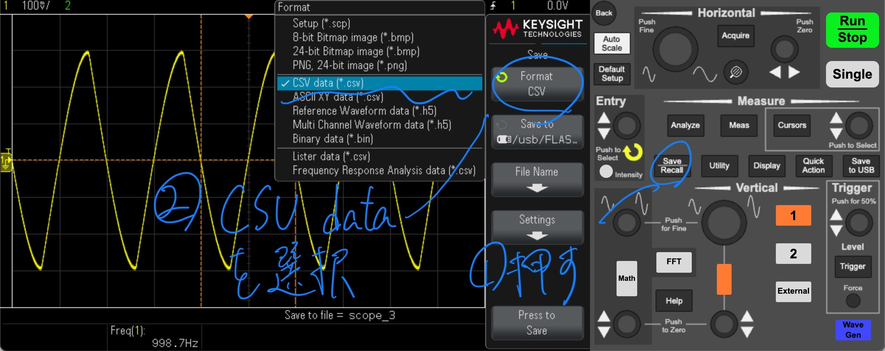  
**波形データをCSVで保存する方法**  

`Save to`で保存するディレクトリを選択できます。デフォルトではUSBメモリが選択されていると思いますから、そのままでも問題なく利用できます。  
また、`File Name`からお好みの名前を設定できます。  

`Settings`では記録するサンプル数を変更できます。記録した波形を基にFFTをしようと考えている場合は最大の50,000にするとナイキスト周波数を伸ばすことができ、幅広い周波数帯でFFTすることができます（時間範囲を広げるのを忘れずに）。  

最後に`Press to Save`を押すと、USBメモリに結果が保存されます。サンプル数が多いとその分保存に時間がかかります。  

また、オシロスコープ側のFFTが有効な状態で波形を記録すると、CSVファイル内に波形データに続いて、FFT結果も記録されます。  

次回から同様の設定で波形データを保存したい場合、操作パネル右側にある`Save to USB`を選択することで一発で保存できるため便利です。  

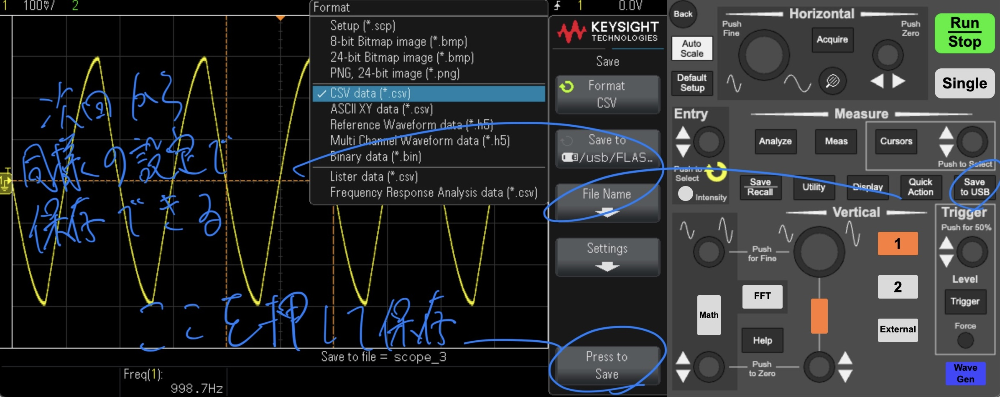  
**Save to USBを押すことで同様の設定で保存できる**  

### FRA結果を保存する
まず、波形の保存と同様にUSBメモリを差し込み、それから`Format`からFRA dataを選択します（下図参照）。  

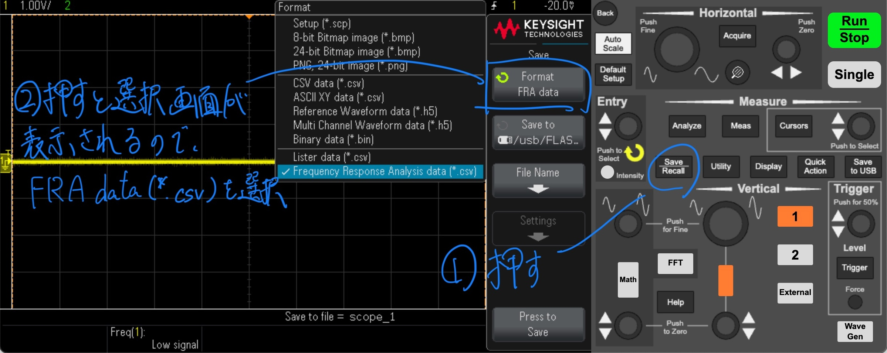  
**FRA結果を保存する方法**  

